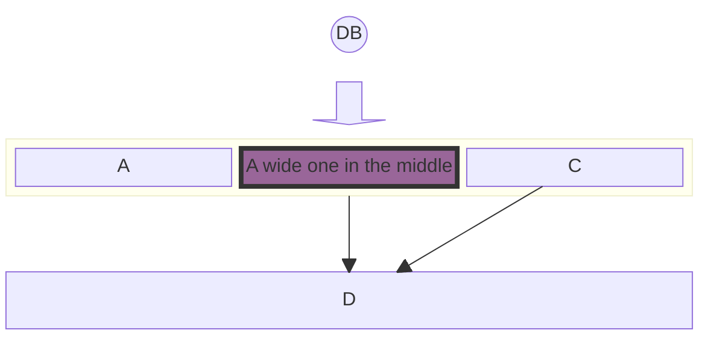
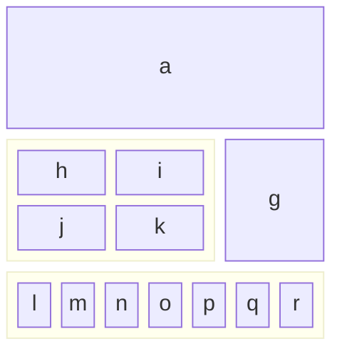
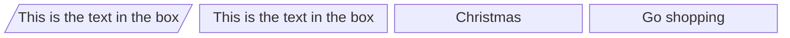
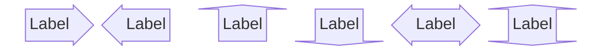
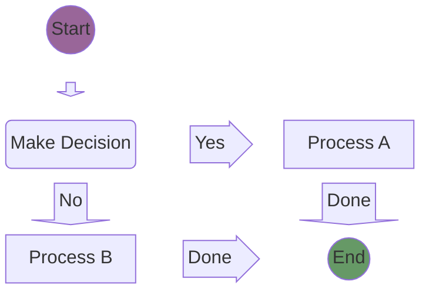
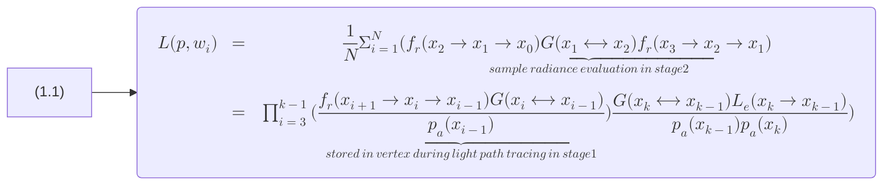
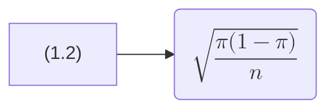
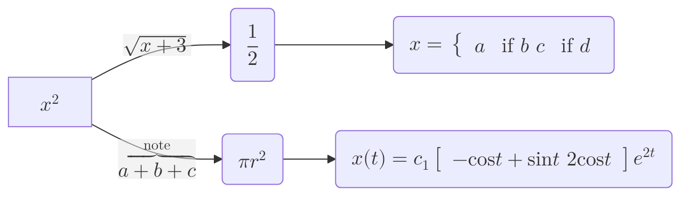
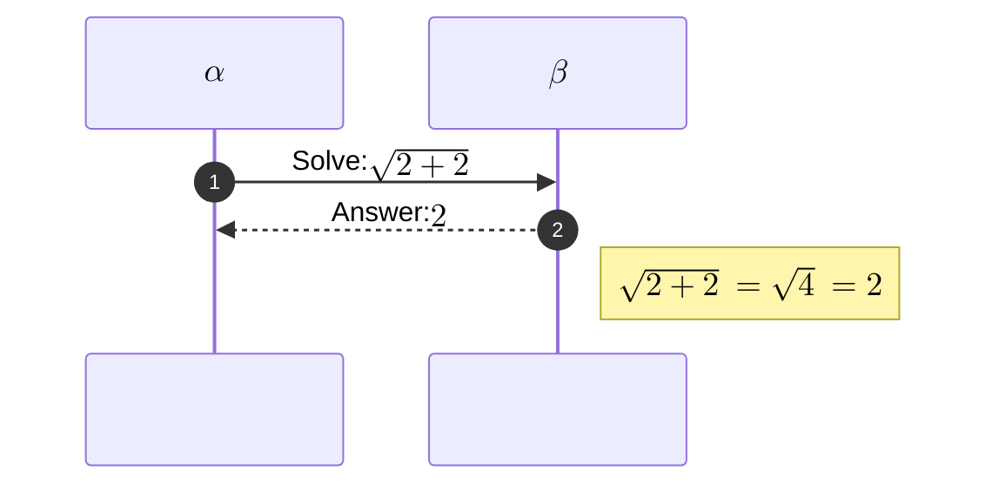

<blockquote style="border-color: #faad14;">
<p><strong>This is a modified version of the <a href="https://github.com/NG-ZORRO/ng-zorro-antd/blob/master/components/icon/doc/index.en-US.md" target="_blank" rel="noopener noreferrer">NG-ZORRO original</a> document provided under <a href="https://github.com/NG-ZORRO/ng-zorro-antd/blob/master/LICENSE" target="_blank" rel="noopener noreferrer">Alibaba.com MIT LICENSE</a>.</strong></p>
</blockquote>

```angular-template-block
<div class="pic-plus" style="text-align: center;">
  <nz-icon nzType="custom:zorro" nzWidth="180px" nzHeight="180px" />
  <span>+</span>
  <nz-icon nzType="custom:angular" nzWidth="180px" nzHeight="180px" />
  <span>=</span>
  <nz-icon nzType="custom:ng-zorro" nzWidth="180px" nzHeight="180px" />
</div>
<div nz-row nzJustify="center" class="p-t-24">
  <app-youtube-player videoId="bGUfm_E5iZo" placeholderImageQuality="high" [width]="width()" />
</div>
<div nz-row nzJustify="center" class="p-t-24">
  <app-youtube-player videoId="7j1t3UZA1TY" placeholderImageQuality="high" [width]="width()" />
</div>
```

#### Example 1



#### Example 2



#### Example 3



#### Example 4



#### Example 5



#### Example 6



#### Example 7



#### Example 8



#### Example 9



## List of icons

We keep in syncing with [antd](https://ant.design/components/icon/).

## API

### nz-icon, [nz-icon]

| Property           | Description                         | Type                           | Default     | Global Config |
| ------------------ | ----------------------------------- | ------------------------------ | ----------- | ------------- |
| `[nzType]`         | Type of the ant design icon         | `string`                       | -           | -             |
| `[nzTheme]`        | Type of the ant design icon         | `'fill'\|'outline'\|'twotone'` | `'outline'` | ✅            |
| `[nzSpin]`         | Rotate icon with animation          | `boolean`                      | `false`     | -             |
| `[nzTwotoneColor]` | Primary color of the two-tone icon. | `string (hex color)`           | -           | ✅            |
| `[nzIconfont]`     | Type of the icon from iconfont      | `string`                       | -           | -             |
| `[nzRotate]`       | Rotate degrees                      | `number`                       | -           | -             |
| `[nzWidth]`        | SVG width                           | `number\|string`               | `1em`       |               |
| `[nzHeight]`       | SVG height                          | `number\|string`               | `1em`       |               |

> In `feather` folder, there are all [official open source SVG icons for Bootstrap](https://github.com/twbs/icons) that can be viewed [here](https://icons.getbootstrap.com/). In `fill`, `outline` and `twotone` folders, there are all [Ant Design SVG icons](https://github.com/ant-design/ant-design-icons/tree/master/packages/icons-svg) that can be viewed [here](https://ant.design/components/icon/). In `custom` folder, there are a few SVG icons added by hand witch can be accessed by `nzType="custom:some-icon-file-name"`.

### NzIconService

| Methods                | Description                                                                   | Parameters               |
| ---------------------- | ----------------------------------------------------------------------------- | ------------------------ |
| `addIcon()`            | To import icons statically                                                    | `IconDefinition`         |
| `addIconLiteral()`     | To statically import custom icons                                             | `string`, `string (SVG)` |
| `fetchFromIconfont()`  | To get icon assets from iconfont                                              | `NzIconfontOption`       |
| `changeAssetsSource()` | Change the location of your icon assets, so that you can deploy them anywhere | `string`                 |

### SVG icons

NG-ZORRO supports svg icons, which bring benefits below:

- Support multiple colors.
- Much more display accuracy in lower-level devices.
- Able to change built-in icons with more props but no styles override.

You can use `nz-icon` component and specify the `theme` property.

```html
<nz-icon nzType="star" nzTheme="fill" />
```

### Static loading and dynamic loading

```angular-template-block
<nz-alert
 nzType="info"
 nzMessage="Note:"
 nzDescription="As for icons provided by Ant Design, there are two ways to import them into your project."
 nzShowIcon
/>
```

**Static loading**. You can load icons statically by registering icons in `app.config.ts` with `provideNzIcons` API.

```ts
import { IconDefinition } from '@ant-design/icons-angular';
import { provideNzIcons } from 'ng-zorro-antd/icon';

// Import what you need. RECOMMENDED. ✔️
import { AccountBookFill, AlertFill, AlertOutline } from '@ant-design/icons-angular/icons';

const icons: IconDefinition[] = [AccountBookFill, AlertOutline, AlertFill];

// Import all. NOT RECOMMENDED. ❌
// import * as AllIcons from '@ant-design/icons-angular/icons';

// const antDesignIcons = AllIcons as Record<string, IconDefinition>;
// const icons: IconDefinition[] = Object.keys(antDesignIcons).map(key => antDesignIcons[key])

export const appConfig: ApplicationConfig = {
  providers: [provideNzIcons(icons)]
};
```

Actually this calls `addIcon` of `NzIconService`. Imported icons would be bundled into your `.js` files.
Static loading may increase your bundle size, thus we recommend to use dynamic importing.

> Icons used by `NG-ZORRO` itself are imported statically to increase loading speed. However, icons demonstrated on the
> official website are loaded dynamically.

**Dynamic loading**. This way would not increase your bundle size. When NG-ZORRO detects that the icon you want to
render hasn't been registered yet, it would fire an HTTP request to load it. All you have to do is to config your
`angular.json` like this:

```json
{
  "assets": [
    {
      "glob": "**/*",
      "input": "./node_modules/@ant-design/icons-angular/src/inline-svg/",
      "output": "/assets/"
    }
  ]
}
```

You can call `changeAssetsSource()` of `NzIconService` to change the location of your icon assets, so that you can
deploy the assets to CDN. The parameter you passed would be added in front of `assets/`.

Assume that you deploy the static assets under `https://mycdn.somecdn.com/icons/assets`. You can call
`changeAssetsSource('https://mycdn.somecdn.com/icons')` to tell NG-ZORRO that all your resources are located there.

### Add Icons in Lazy-loaded Components

Sometimes, you want to import icons in lazy components to avoid increasing the size of the `main.js`.
You can import icons in `providers` of the component or router with `provideNzIconsPatch` API.

```ts
import { NzIconModule, provideNzIconsPatch } from 'ng-zorro-antd/icon';

// in xxx.component.ts
@Component({
  imports: [NzIconModule],
  providers: [provideNzIconsPatch([QuestionOutline])]
})
class ChildComponent {}

// or in xxx.routes.ts
const routes: Routes = [
  {
    path: '',
    providers: [provideNzIconsPatch([QuestionOutline])]
  }
];
```

Once the QuestionOutline icon get loaded, it would be usable across the application.

### Set Default TwoTone Color

When using two-tone icons, you should provide a global configuration like `{ nzIcon: { nzTwotoneColor: 'xxx' } }` via `NzConfigService` or call corresponding `set` method to change to default twotone color.

### Custom Font Icon

We provided a `fetchFromIconfont` method, which is specified for iconfont, to help you use your own icons deployed at [iconfont.cn](http://iconfont.cn/) in a convenient way.

```ts
this._iconService.fetchFromIconfont({
  scriptUrl: 'https://at.alicdn.com/t/font_8d5l8fzk5b87iudi.js'
});
```

And then you can use it like this:

```html
<nz-icon nzIconfont="icon-tuichu" />
```

It creates a component that uses SVG sprites in essence.

The following options are available:

| Property    | Description                               | Type     | Default |
| ----------- | ----------------------------------------- | -------- | ------- |
| `scriptUrl` | The URL generated by iconfont.cn project. | `string` | -       |

The property `scriptUrl` should be set to import the svg sprite symbols.

See [iconfont.cn document](https://www.iconfont.cn/help/detail?helptype=code) to learn about how to generate the `scriptUrl`.

### Namespace

We introduced namespace so you could add your own icons in a convenient way.
When you want to render an icon, you could assign `type` `namespace:name`. Dynamic importing and static importing are both supported.

Static importing. Invoke `addIconLiteral` of `NzIconService`.

Dynamic importing. Make sure that you have put your SVG resources in directory like `assets/${namespace}`.
For example, if you have a `panda` icon and in `zoo` namespace, you should put the file `panda.svg` in `assets/zoo`.

## FAQ

### All my icons are gone!

Have you ever read the docs above?

### There are two similar icons in a `<span></span>` tag. What happened?

In older versions of NG-ZORRO, there was a font file which would use `:before` to insert an icon according to a `<i>` tag's `class`.
So if you have two icons, try to remove `node_modules` and install again. If the problem is still there, search `@icon-url` and remove that line.

### I want to import all icons statically. What should I do?

Although it is not recommended, actually we demonstrate it at section <a href="https://ng.ant.design/components/icon/en#static-loading-and-dynamic-loading" target="_blank" rel="noopener noreferrer">Static loading and dynamic loading</a>:

```ts
import * as AllIcons from '@ant-design/icons-angular/icons';

const antDesignIcons = AllIcons as Record<string, IconDefinition>;
const icons: IconDefinition[] = Object.keys(antDesignIcons).map(key => antDesignIcons[key]);
```

### Does dynamic loading affect web pages' performance?

We used several methods to reduce requests, such as static cache, dynamic cache and reusable request.
It's basically not noticeable for visitors that icons are loaded asynchronously assuming web connections are fairly good.

### How do I know an icon's corresponding module to import?

Capital camel-case `type & theme`, i.e. `alibaba` => `AlibabaOutline`.